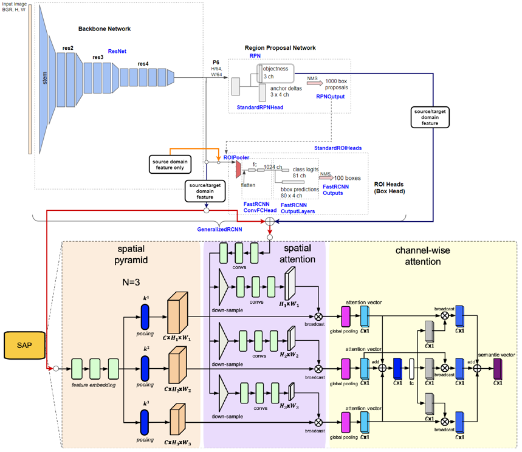

# A Detectron2 Implementation of [Spatial Attention Pyramid Network for Unsupervised Domain Adaptation](https://arxiv.org/pdf/2003.12979.pdf) (ECCV 2020)

offical implementation: [IntelligentTEAM/ECCV 2020 Domain Adaption](https://isrc.iscas.ac.cn/gitlab/research/domain-adaption)

## Network architecture
  
When target domain feature feed into RPN, RPN loss is not calculated, just generate logit feature for SAP, i.e., target domain annotations are not used.  

## Environment
```
python 3.8.11
pytorch 1.9.0 (conda)
torchvision 0.10.0 (conda)
detectron2 0.5+cu111 (pip)
tensorboard 2.6.0 (pip)
opencv-python (pip)
pycocotools (pip)
```

## Data preparation

1. make your dataset format to voc or coco, or [other format](https://detectron2.readthedocs.io/en/latest/tutorials/builtin_datasets.html) that detectron2 supports
2. register your dataset at [detection/data/register.py](./detection/data/register.py)
3. test set format must be VOC becuase we use VOC metric to evaluate result

```python
# VOC format
dataset_dir = $YOUR_DATASET_ROOT
classes = ('person', 'two-wheels', 'four-wheels') # dataset classes
years = 2007
# to find image list at $YOUR_DATASET_ROOT/ImaegSets/Main/{$split}.txt, only "train", "test", "val", "trainval"
split = 'train'
# call your dataset by this
meta_name = 'itri-taiwan-416_{}'.format(split)
# call register_pascal_voc to register
register_pascal_voc(meta_name, dataset_dir, split, years, classes)
```

## Configuration file explanation
<details>
<summary>Configuration</summary>

``` yaml
# load some basic settings
_BASE_: "./Base-RCNN-C4.yaml"
# dataset settings, souce and target domain dataset, but test set does not have domain setting
DATASETS:
  # domain adaptation trainer's training setting
  SOURCE_DOMAIN:
    TRAIN: ("cityscapes_train",)
  TARGET_DOMAIN:
    TRAIN: ("foggy-cityscapes_train",)
  # default trainer's training setting,
  # when not using domain adaptation, load this training set to train noraml faster-rcnn
  TRAIN: ("cityscapes_train",)
  TEST: ("foggy-cityscapes_val",)
MODEL:
  # code implementation at detection/meta_arch/sap_rcnn.py
  META_ARCHITECTURE: "SAPRCNN"
  BACKBONE:
    # resnet baskbone
    NAME: "build_resnet_backbone"
    # resnet has 5 stages, only freeze stem, same as original SAP setting
    FREEZE_AT: 1
  WEIGHTS: "detectron2://ImageNetPretrained/MSRA/R-50.pkl"
  KEYPOINT_ON: False
  MASK_ON: False
  # determine whether to use domain adaptation or not, if not, just a normal faster rcnn
  DOMAIN_ADAPTATION_ON: False
  # RPN setting
  PROPOSAL_GENERATOR:
    # code implementation at detection/modeling/rpn.py
    NAME: "SAPRPN"
  ROI_HEADS:
    # use detectron2 resnet default setting
    NAME: "Res5ROIHeads"
    # same as dataset class, it not count background in 
    NUM_CLASSES: 8
    # determine confidence threshold, 
    # boxes are outputed on images while testing if its confidence is above threshold
    SCORE_THRESH_TEST: 0.75
  # Domain adaptation head settings, code implementation at detection/da_heads/sapnet.py
  DA_HEADS:
    # input, feature comes from backbone
    IN_FEATURE: "res4"
    # IN_FEATURE channel
    IN_CHANNELS: 1024
    # how many different size anchors in image for anchor generator, len(anchor_size) * len(aspect_ratio)
    NUM_ANCHOR_IN_IMG: 15
    EMBEDDING_KERNEL_SIZE: 3
    EMBEDDING_NORM: True
    EMBEDDING_DROPOUT: True
    # loss function, only supports cross entropy
    FUNC_NAME: "cross_entropy"
    # spatial pyramid pooling function, supports max and avg
    POOL_TYPE: 'avg'
    # adversarial loss weight, constant during training
    LOSS_WEIGHT: 1.0
    # spatial pyramid pooling setting
    WINDOW_STRIDES: [2, 2, 2, 2, 2, 2, 2, 2, 2, 2, 2, 2, 2]
    WINDOW_SIZES: [3, 6, 9, 12, 15, 18, 21, 24, 27, 30, 33, 35, 37]
INPUT:
  # data augmentation setting, resize short edge
  MIN_SIZE_TRAIN: (800, 832, 864, 864, 896, 928, 960, 992, 1024)
  MIN_SIZE_TRAIN_SAMPLING: "choice"
  MAX_SIZE_TRAIN: 2048
  # not to resize input during testing
  MIN_SIZE_TEST: 1024
  MAX_SIZE_TEST: 2048
# optimizer setting, SGD is used in baseline training, Adam is used in SAP training
SOLVER:
  IMS_PER_BATCH: 1 # batch size
  # learning rate decay step
  STEPS: (70000, 80000)
  # learning rate
  BASE_LR: 0.00001
  MAX_ITER: 90000
  CHECKPOINT_PERIOD: 5000
TEST:
    # determine how many steps to run inference on test set to get metric(mAP), 0 is not to run
  EVAL_PERIOD: 5000
# determine how many steps to get image record(eg., predicted proposal generated by rpn) during traing,
# smaller to make tfevents file larger 
VIS_PERIOD: 5000
```
</details>

* [baseline_R_50_C4_1x-city2foggy.yaml](./configs/baseline_R_50_C4_1x-city2foggy.yaml) is a normal fatser rcnn configuration file  
* [sap_R_50_C4_1x-city2foggy.yaml](./configs/sap_R_50_C4_1x-city2foggy.yaml) is faster rcnn with SAP configuration file

### Usages
1. Train a model without SAP (normal faster rcnn) using source domain data (baseline)
2. Train whole model using baseline model weight
* train a model
``` bash
python tools/train_net.py --config-file $CONFIG_FILE_PATH --num-gpus 1
```
* test the model
``` bash
# update MODEL.WEIGHTS by command line
python tools/train_net.py --config-file $CONFIG_FILE_PATH --num-gpus 1 --eval-only MODEL.WEIGHTS $MODEL_WEIGHT_PATH
```
* predict boxes on the test set
``` bash
python tools/train_net.py --config-file $CONFIG_FILE_PATH --num-gpus 1 --test-images MODEL.WEIGHTS $MODEL_WEIGHT_PATH  MODEL.ROI_HEADS.SCORE_THRESH_TEST 0.75
```
## Experiments
* Cityscapes -> Foggy Cityscapes

| Setting | Backbone | person | rider | car | truck | bus | train | motorcycle | bicycle | mAP |
|:-------------:|:-------------:|:-------------:|:-------------:|:-------------:|:-------------:|:-------------:|:-------------:|:-------------:|:-------------:|:-------------:|
| baseline, w/o DA, paper | vgg16   | 24.1 | 33.1 | 34.3 | 4.1 | 22.3 | 3.0 | 15.3 | 26.5 | 20.3|
| SAP, w/ DA, paper | vgg16         | 40.8 | 46.7 | 59.8 | 24.3 | 46.8 | 37.5 | 30.4 | 40.7 | 40.9 |
| baseline, w/o DA, ours | resnet50 | 33.65 | 38.99 | 39.98 | 22.42 | 22.61 | 9.091 | 26.93 | 37.42 | 28.83 |
| SAP, w/ DA, ours | resnet50       | 47.02 | 52.82 | 57.64 | 29.36 | 43.61 | 26.12 | 31.98 | 48.75 | 41.7 |
